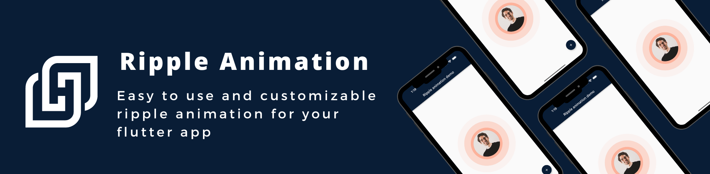
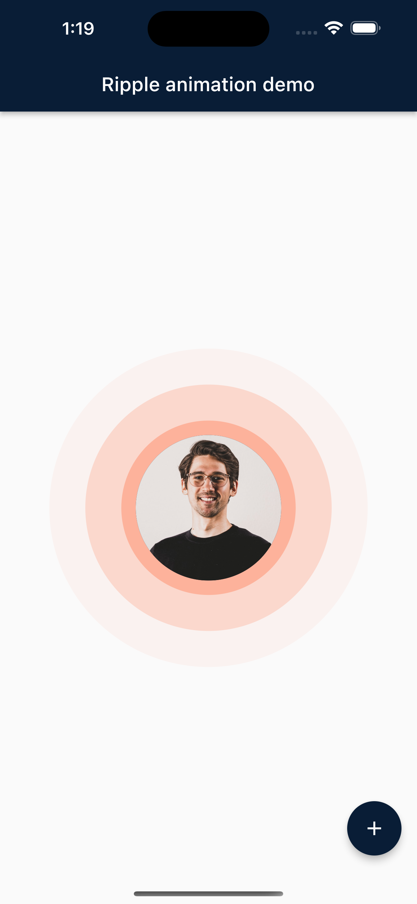
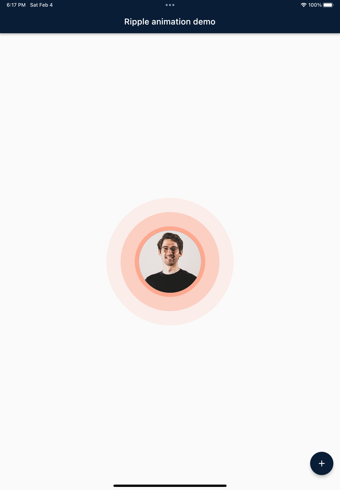
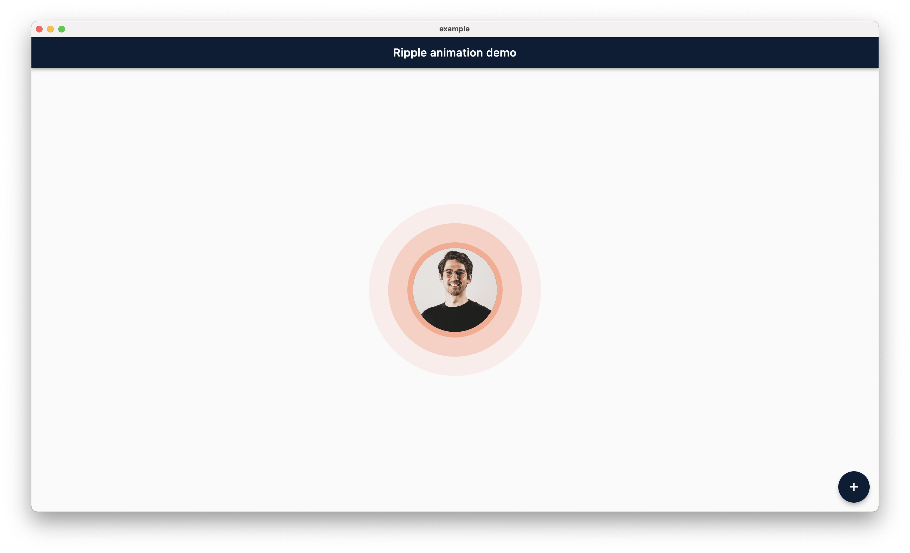
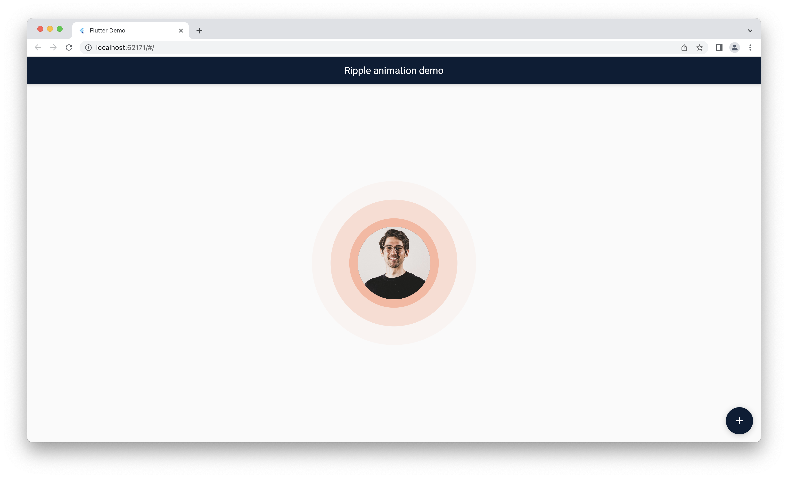

## Simple Ripple Animation
This package provide ripple animation widget that can be customised to meet your needs. It's easy to set up and customize, and it looks beautiful in any color you choose.


# Features

This package support following parameter and methods.

## Parameter
`RippleAnimation`widget provide follwoing parameter to config your ripple animation effect.

Parameter defined for `RippleAnimation` widget:

| Name | Type | Description |
|------|------------|-------------|
| child | Widget | This child will be placed at center of the animation. |
| delay | Duration | This will be delay between two ripple wave. |
| minRadius | int | Minimum radius of the ripple wave. |
| color | Color | Color of the animation. |
| ripplesCount | int | number of rippleCount in the wave. |
| duration | Duration | duration of the animation |
| repeat | bool | Provide true if you want to repeat animation |


# Getting started

## Installing

1. Add dependencies to `pubspec.yaml`

   Get the latest version in the 'Installing' tab
   on [pub.dev](https://pub.dev/packages/simple_ripple_animation/install)

    ```yaml
    dependencies:
        simple_ripple_animation: <latest-version>
    ```

2. Run pub get.

   ```shell
   flutter pub get
   ```

3. Import package.

    ```dart
    import 'package:simple_ripple_animation/simple_ripple_animation.dart';
    ```

## Implementation

1. Wrap `Widget` with `RippleAnimation` and assign needed parameter.

    ```dart
             RippleAnimation(
                child: CircleAvatar(
                  minRadius: 75,
                  maxRadius: 75,
                  backgroundImage: NetworkImage(Constants.avtarUrl),
                ),
                color: Colors.deepOrange,
                delay: const Duration(milliseconds: 300),
                repeat: true,
                minRadius: 75,
                ripplesCount: 6,
                duration: const Duration(milliseconds: 6 * 300),
              )
    ```

 


# Preview

## Screenshot
TODO: Here is the few screenshot for the preview. This will be remove in new verison becuase pub.dev now support screenshot.
<table>
  <tr>
       <td align="center"> <br /><sub><b>Mobile</b></sub> </td>     
         <td align="center"> <br /><sub><b>Tablet</b></sub> </td>  </tr>   
           <tr>
       <td align="center"> <br /><sub><b>Desktop</b></sub> </td>     
         <td align="center"> <br /><sub><b>Web</b></sub> </td>  </tr> 
      
</table>

## Main Contributors
<table>
  <tr>
       <td align="center"><a href="https://github.com/vatsaltanna"><br /><sub><b>Jemis Goti</b></sub></a></td>
 
</tr>
</table>
<br/>

## Thanks

Thank you for using this package and keep supporting opensource community.